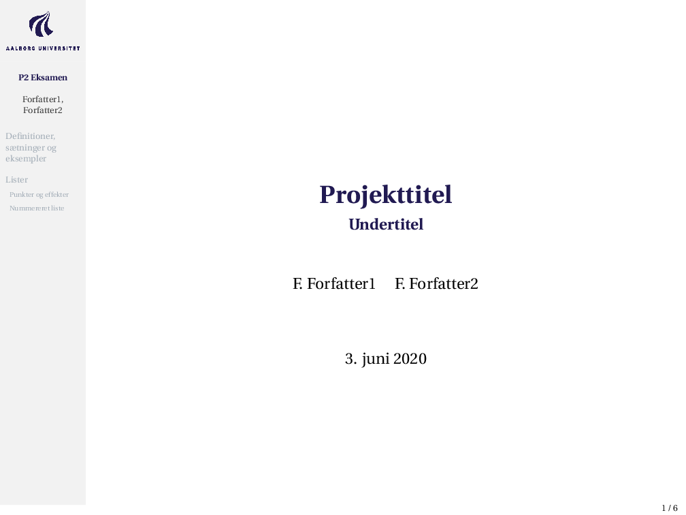
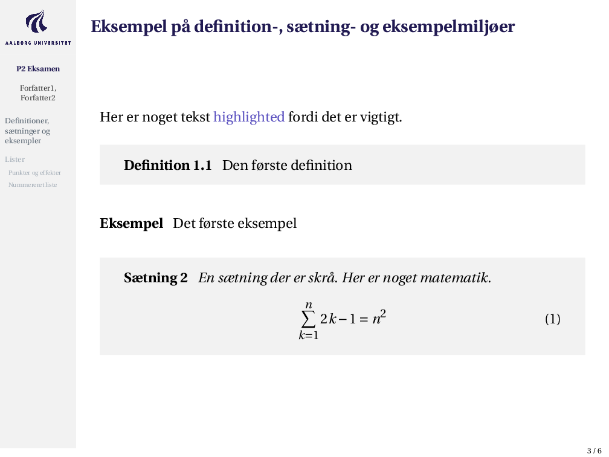

# AAU beamer skabelon
Dette er en simpel skabelon til en beamer for studerende på Aalborg Universitet skrevet i LaTeX.

Guide til at bruge skabelonen:
1. Klik "Use this template" på denne GitHub side.
2. Udfyld detaljerne for dit projekt i GitHub.
3. Klon dit git repository ned på din computer, eller evt. opret det som et OverLeaf projekt ved at følge denne guide. (https://www.overleaf.com/learn/how-to/How_do_I_push_a_new_project_to_Overleaf_via_git%3F)

I skabelonen er der inkluderet korte eksempler på hvordan den kan bruges.
Disse frames kan naturligvis slettes.

